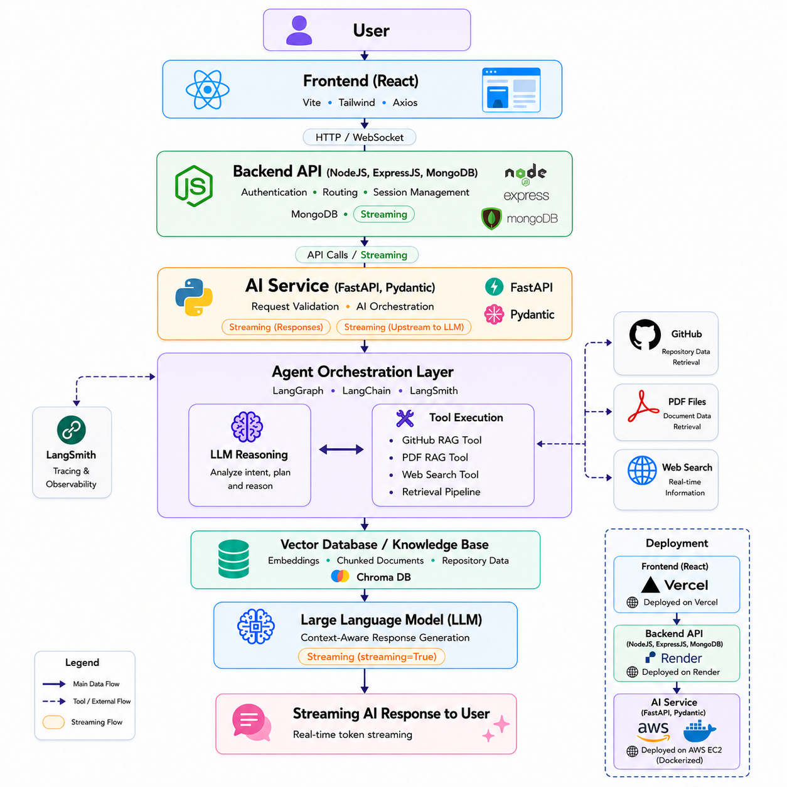

# 🤖 Agentic RAG Chatbot

An AI-powered Agentic Retrieval-Augmented Generation (RAG) chatbot that combines LLM reasoning, document retrieval, and tool-based workflows to provide context-aware and accurate responses.

## 🚀 Overview

Agentic RAG Chatbot is designed to go beyond traditional chat applications by integrating:

* Retrieval-Augmented Generation (RAG)
* Agent-based decision making
* GitHub repository knowledge retrieval
* Web search capabilities
* Multi-step reasoning workflows
* Context-aware conversations

The system allows users to interact with an intelligent chatbot that can retrieve information from external knowledge sources, reason over the retrieved context, and generate grounded responses.

---

## ✨ Features

### 🧠 Agentic Workflow

The chatbot uses an agent-based architecture powered by LangGraph and LangChain to intelligently decide how a user query should be processed.

Instead of directly sending every query to the LLM, the agent:

* Understands the intent of the user.
* Decides whether retrieval is required.
* Chooses which tools should be executed.
* Performs multi-step reasoning when necessary.

For example:

* Simple conversational questions may be answered directly by the LLM.
* Repository-related questions can trigger the GitHub RAG pipeline.
* Real-time questions can invoke the web search tool.

This makes the system more dynamic, scalable, and context-aware compared to traditional chatbot architectures.

---

### 📚 Retrieval-Augmented Generation (RAG)

The application uses a Retrieval-Augmented Generation pipeline to provide grounded and context-aware responses.

Instead of relying only on the LLM’s pretrained knowledge, the system:

1. Retrieves relevant information from external knowledge sources.
2. Injects the retrieved context into the prompt.
3. Generates responses based on the retrieved data.

Key capabilities:

* Semantic similarity search using embeddings.
* Context-aware response generation.
* Reduced hallucinations.
* Improved factual accuracy.

This approach allows the chatbot to answer questions using actual repository data and documentation.

---

### 🐙 GitHub Repository RAG

The chatbot can analyze GitHub repositories and answer repository-specific questions.

#### Workflow:

1. User submits a GitHub repository URL.
2. The system checks whether the repository is already indexed.
3. If not indexed:

   * Repository cloning is performed.
   * Files are parsed and chunked.
   * Embeddings are generated.
   * Data is stored in the vector database.
4. User queries are converted into embeddings.
5. Semantic retrieval fetches relevant code and documentation.
6. Retrieved context is passed to the LLM for grounded response generation.

The chatbot can:

* Explain project architecture.
* Analyze codebases.
* Retrieve relevant code snippets.
* Summarize documentation.
* Answer implementation-specific questions.

This enables repository-aware AI conversations instead of generic responses.

---

### 🌐 Web Search Integration

The application includes web search capabilities for handling queries that require real-time or external information.

When the agent determines that local knowledge is insufficient, it can:

* Perform external web searches.
* Retrieve relevant information.
* Combine search results with LLM reasoning.

This allows the chatbot to:

* Access updated information.
* Improve answer quality.
* Handle dynamic and real-world queries.

The web search tool works alongside the RAG pipeline to provide more complete responses.

---

### 💬 Conversational Memory

The chatbot maintains conversational context across interactions to support natural multi-turn conversations.

Instead of treating every message independently, the system:

* Stores conversation history.
* Understands follow-up questions.
* Maintains contextual continuity.

Example:

* User: “Explain the authentication flow.”
* User: “Where is JWT validation implemented?”

The chatbot understands that the second question refers to the previously discussed repository context.

This improves user experience and enables more human-like interactions.

---

### ⚡ Streaming Responses

The application supports real-time streaming responses for faster and more interactive conversations.

Instead of waiting for the complete response to generate:

* Tokens are streamed incrementally.
* Users receive output in real time.
* Perceived latency is reduced.

Streaming improves:

* User experience.
* Responsiveness.
* Interaction smoothness.

The streaming pipeline is implemented using FastAPI streaming responses and integrated with the frontend for live token rendering.

### 🗂️ Multi-Session Chat Support
* Supports multiple independent chat sessions.
* Maintains separate conversational context for each session.
* Allows users to seamlessly switch between conversations while preserving chat history.

---

## 🏗️ Architecture



---

## 🛠️ Tech Stack

### Frontend

* React
* Vite
* Redux
* Tailwind CSS
* Axios

### Backend

* Node.js
* Express.js
* MongoDB

### AI / Agent Layer

* LangGraph
* LangChain
* Large Language Models (LLMs)
* FastAPI
* MongoDB/Atlas
* PostgreSQL/Neon

### Retrieval

* Vector Database
* Embeddings
* RAG Pipeline

### Deployment

* AWS EC2
* Docker
* Render
* Vercel

---

## 📂 Project Structure

```text
Present in filestructure.txt file.
```

---

## ⚙️ Installation

### 1. Clone the Repository

```bash
git clone https://github.com/DanishIslam10/agentic-rag-chatbot.git
cd agentic-rag-chatbot
```

### 2. Install Dependencies

#### Frontend

```bash
cd client
npm install
```

#### Backend

```bash
cd server
npm install
```

#### AI-Service
```bash
cd ai-service
pip install -r requirements.txt
```

### 3. Configure Environment Variables

Create a `.env` file and add the required environment variables.

Example: For Frontend (client)

```env
VITE_SERVER_ENDPOINT=your-server-endpoint
VITE_CLERK_PUBLISHABLE_KEY=your-clerk-publishable-key
```

Example: For Backend (server)

```env
PORT=
MONGODB_URL=
OPENAI_API_KEY=
JWT_SECRET=
AI_SERVICE_URL=
CLERK_SECRET_KEY=
CLERK_PUBLISHABLE_KEY=
```

Example: For AI Service (ai-service)

```env
OPENAI_API_KEY=
DB_URI=
LANGSMITH_TRACING=
LANGSMITH_ENDPOINT=
LANGSMITH_API_KEY=
LANGSMITH_PROJECT=
MONGODB_URI=
MONGODB_NAME=
```

### 4. Start the Application

#### AI-Service

```bash
cd ai-service
uvicorn app.main:app --reload
```

#### Backend

```bash
cd server
npm run dev
```

#### Frontend

```bash
cd client
npm run dev
```

---

## 🔄 Workflow

1. User submits a query.
2. Agent analyzes the request.
3. Relevant tools are selected.
4. Retrieval pipeline gathers context.
5. LLM reasons over retrieved information.
6. Final grounded response is generated.
7. Response is streamed back to the user.

---

## 🚧 Future Improvements

* Multi-agent collaboration.
* Additional MCP integrations.
* Better memory management.
* Advanced document ingestion.
* Multiple vector database support.

---

## 👨‍💻 Author

**Danish Islam**

GitHub: [https://github.com/DanishIslam10](https://github.com/DanishIslam10)

If you found this project useful, consider giving it a ⭐ on GitHub.
